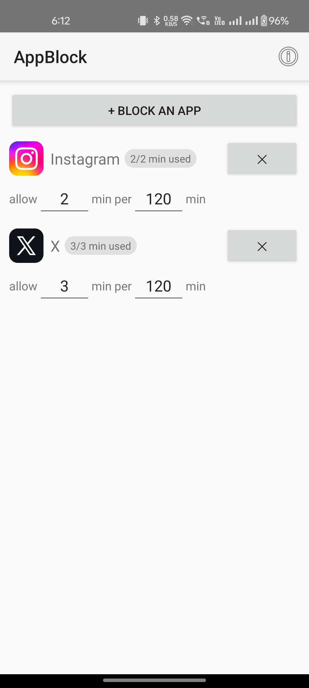
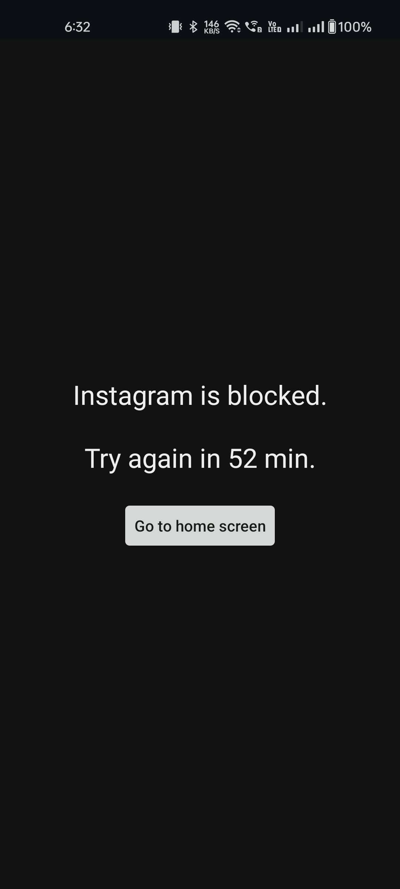

> [!IMPORTANT]
> This was written entirely with AI, and I haven't verified any of the code. Please use it with caution — though I do trust [Claude's Plan](https://www.youtube.com/watch?v=gFx-NjTw3sM). The app will go on the Play Store after I do a manual security and performance audit. All apps from me will be held to the highest quality standards. I will not ship slop.

# appblock

|  |  |
| ---------------------------------------- | ------------------------------------- |

Personal Android app blocker — like [siteblock](https://github.com/csapuntz/siteblock), but for apps.
Pick apps and give each a budget: **allow X minutes per rolling Y minutes**. When the budget
is spent, opening the app bounces you to a "blocked, try again in N min" screen.

No dependencies, no network, no analytics. Everything stays on your phone.

## What exactly gets blocked

The mental model: **it's a door on the app's screen, not a gag on the app.**
The app lives its normal background life — you just can't look at it.

**Blocked during a block window:**

- **Opening the app** — from the launcher, recents, widgets, share sheet, links,
  anything. The moment the app's window hits the foreground the block wall covers
  it, with a button to go home.
- **Tapping one of its notifications** — the notification arrives and is readable,
  but tapping it opens the app → blocked like any other open.
- **Overstaying** — if you're mid-scroll when the budget runs out (checked every
  5 seconds), the wall drops over the app.

**NOT blocked:**

- **Notifications** — they arrive, buzz, and show on the lock screen exactly as
  always. Inline actions (e.g. replying to a message from the notification) work,
  since they never open the app's window.
- **Background activity** — messages keep syncing, downloads keep running, audio
  keeps playing. A blocked Spotify keeps playing what's queued; you just can't
  open its UI.
- The budget clock only ticks while the app is **on screen** — background use
  costs nothing.

**Edge cases:**

- **Incoming calls in blocked apps** (WhatsApp/Telegram): the ring notification
  appears, but the full-screen incoming-call UI is the app's window — answering
  while the app is over budget will likely get bounced. Think twice before
  blocking an app you take calls on.
- **Picture-in-picture** mini-players are untested; entering the app to start one
  is blocked regardless.
- A blocked app's content shown _inside another app_ (e.g. a YouTube video
  embedded in a browser) is not blocked — only the app's own windows are.

## Install (via adb — read this, it saves you two roadblocks)

Don't install by copying the APK to the phone and tapping it. Two Android guards
will fight you, because this is a sideloaded, debug-signed APK that requests an
accessibility service:

1. **Google Play Protect** blocks the install ("app blocked to protect your device") —
   it flags any APK from an unrecognized developer, especially ones using accessibility.
2. Even after installing, **Android 13+ "Restricted setting"** refuses to let a
   file-manager-installed app have accessibility access.

Installing over USB with `adb` avoids **both**: Play Protect doesn't gate adb installs,
and adb-installed apps are exempt from the restricted-settings block.

One-time phone setup: Settings → About device → tap **Build number** 7 times to unlock
Developer options, then Settings → System → **Developer options** → enable
**USB debugging**. Plug the phone into the computer and accept the
"Allow USB debugging?" prompt on the phone.

```sh
adb install appblock.apk   # adb ships with the Android SDK platform-tools
```

## Setup (once)

1. Open AppBlock → tap **Enable accessibility service** → turn on AppBlock.
   (The button disappears once granted.)
2. Tap **+ Block an app**, check the apps you want, hit **Block selected apps**.
3. Adjust each app's budget on the home screen — changes save automatically.
4. OnePlus/OxygenOS kills background services: Settings → Apps → AppBlock →
   Battery → set to **Unrestricted / Don't optimize**.

## How the rolling window works

Every usage session is logged as a `[start, end]` interval. An app is blocked when the
summed usage inside the trailing window (e.g. last 120 min) reaches the allowance
(e.g. 5 min). Old usage "ages out" of the window continuously — no fixed reset times.
While a tracked app is open, the service re-checks every 5 seconds so a session is cut
off mid-use the moment the budget runs out.
